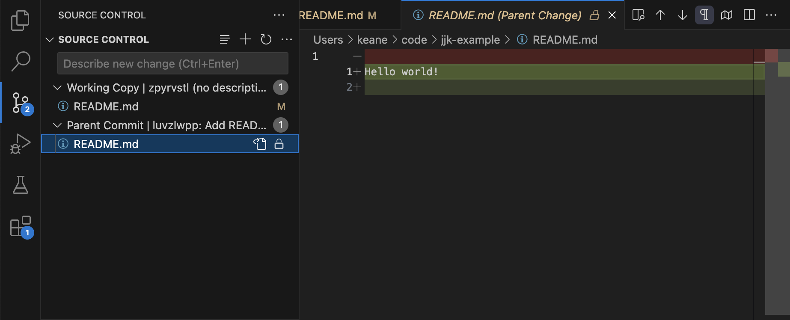
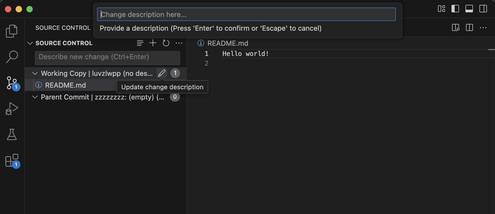

# Jujutsu Kaizen

[Jujutsu (jj) version control system](https://github.com/jj-vcs/jj) extension for VS Code.

## Features

The goal of this extension is to bring the great UX of Jujutsu into the VS Code UI. We are currently focused on achieving parity for commonly used features of VS Code's built-in Git extension, such as the various operations possible via the Source Control view.

- View file statuses of the Working Copy change.
- View file statuses of all parents of the Working Copy change.
- View diffs of files modified in the Working Copy or its parents.
  
- Edit the description of the Working Copy or its parents.
  
- Create a new change, with or without a description.

## Requirements

`jj` must be in your `$PATH` for this extension to work.

## Known Issues

Opening multiple Jujutsu repositories in the same VS Code workspace is currently not supported. We intend to address this shortcoming soon.
