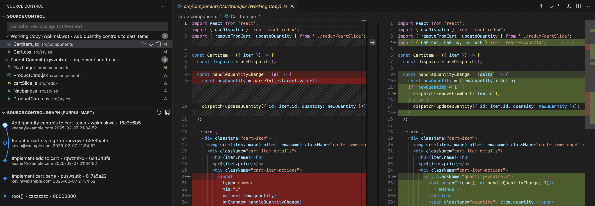
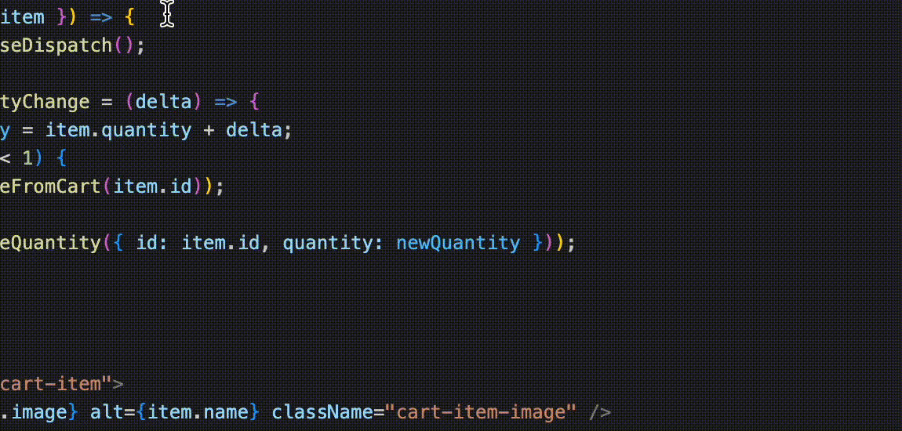
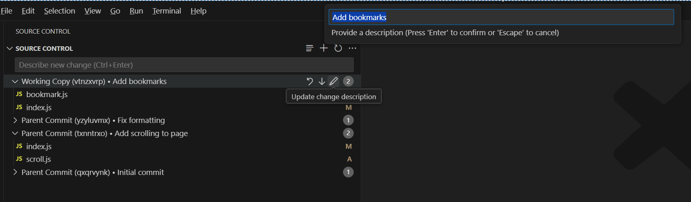
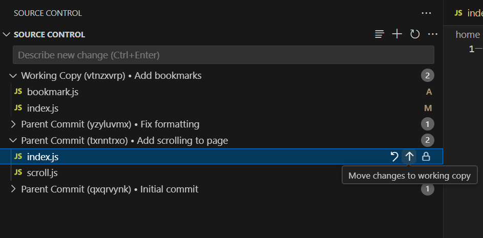
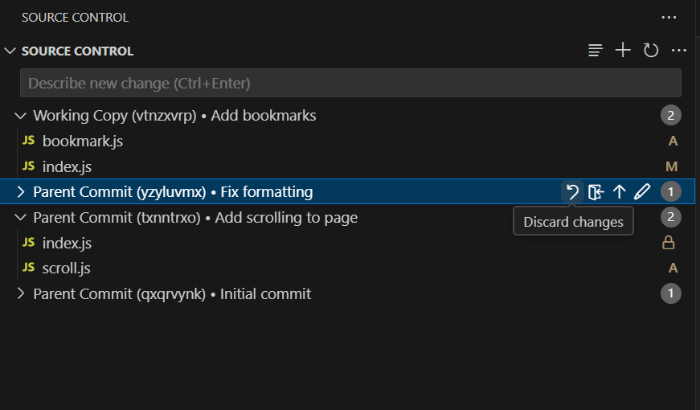
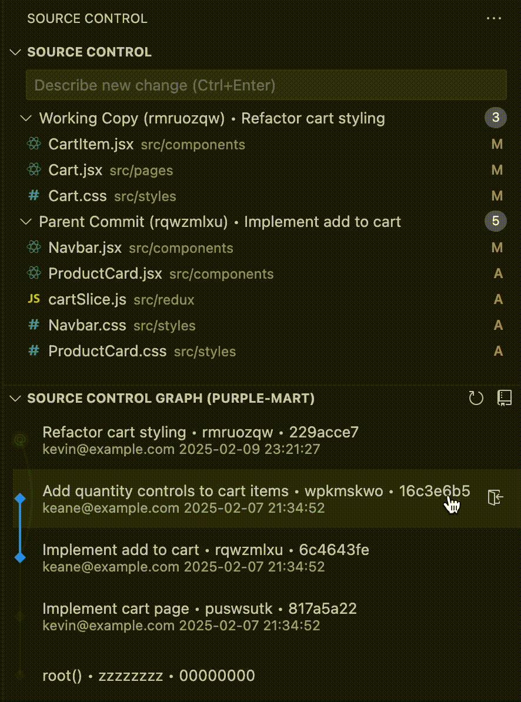
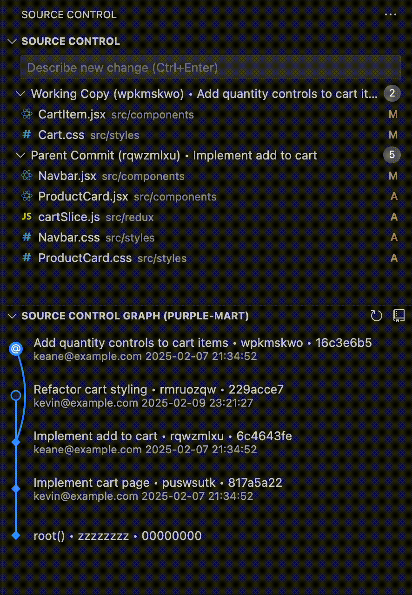

# Jujutsu Kaizen

> A Visual Studio Code extension for the [Jujutsu (jj) version control system](https://github.com/jj-vcs/jj).

## 🚀 Features

The goal of this extension is to bring the great UX of Jujutsu into the VS Code UI. We are currently focused on achieving parity for commonly used features of VS Code's built-in Git extension, such as the various operations possible via the Source Control view. 

Here's what you can do so far:

### 📁 File Management

- Track file statuses in the Working Copy
- Monitor file statuses across all parent changes
- View detailed file diffs for Working Copy and parent modifications  
  
- View line-by-line blame  
  

### 💫 Change Management

- Create new changes with optional descriptions
- Edit descriptions for Working Copy and parent changes  
  
- Move changes between Working Copy and parents  
  
- Discard changes  
  
- Browse and navigate revision history  
  
- Create merge changes  
  

### 🔄 Operation Management

- Undo jj operations or restore to a previous state  
  

## 📋 Prerequisites

- Ensure `jj` is installed and available in your system's `$PATH`

## 🐛 Known Issues

If you encounter any problems, please [report them on GitHub](https://github.com/keanemind/jjk/issues/)!

## 📝 License

This project is licensed under the [MIT License](LICENSE).